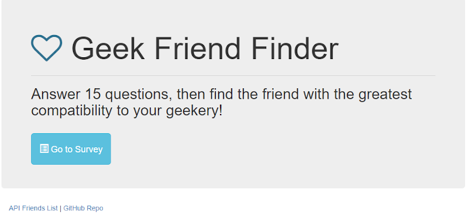
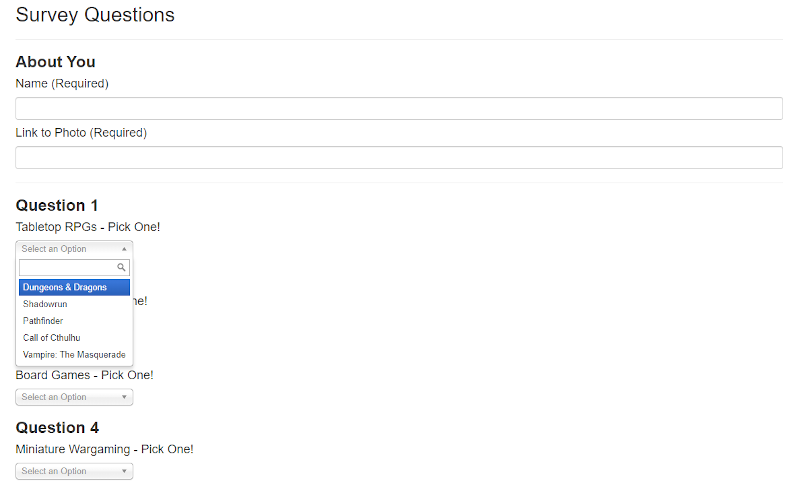

# FriendFinder
_created by Krista Clarke (github - loraxgirl)_ 
**Geeky Friend Finder Matching Program**

## Assignment Details
**UCLA Full-stack Web Development Bootcamp - Week 13 Homework** 
Built a compatibility-based "FriendFinder" application. I chose to do a 'geek' theme. It's a full-stack site that takes in results from a survey and compares the answers to the saved profiles of other users. App will then display the name and picture of the best match based on the survey answers.

Used multiple Node modules, and **deployed to Heroku for the first time**. 

### Technologies Used
* JavaScript
  * Node.js
    * Express
    * Body-Parser

* Heroku

[View App on Heroku](https://stark-stream-58245.herokuapp.com/)

### Screenshots Of The App
**_Home Page_** Home page of Geeky Friend Finder

**_Survey Page_** A quick look at the survey questions

